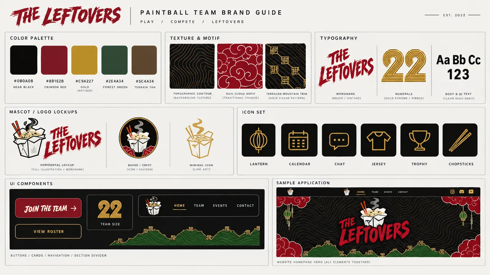
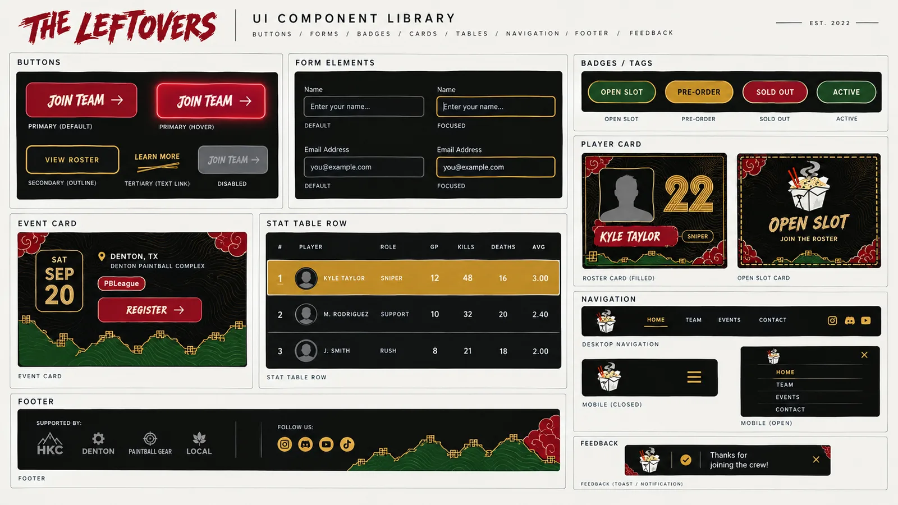
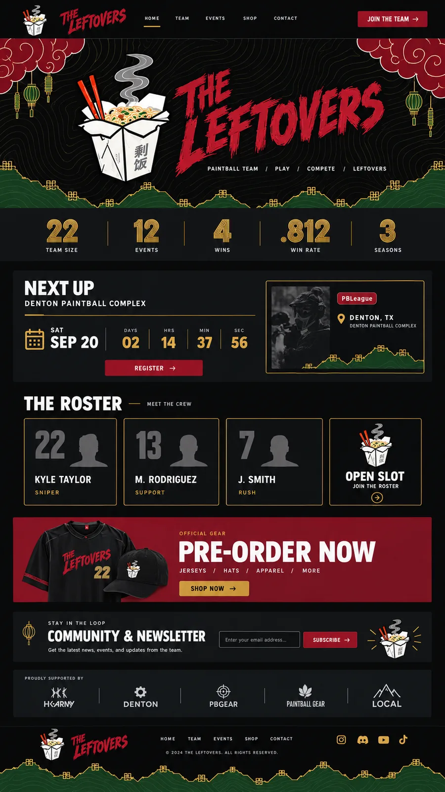
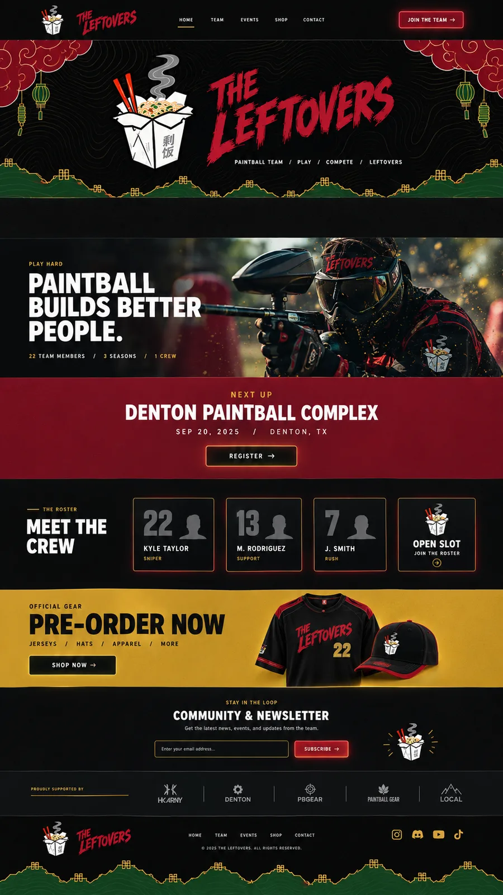

# The Leftovers — team website

Static site for **The Leftovers**, a semi-professional, community-run paintball
team with a rotating free-agent roster.

Live at **[theleftoverspb.com](https://theleftoverspb.com)**.

Built against `_reference/the-leftovers-website-PRD.md` and the brand style
guide alongside it. Note that `_reference/` is gitignored, so those files are
local-only — section references below (§4, §8.1, §10.2 and so on) point into
that PRD. If you've cloned this and don't have it, ask the captain for a copy;
the decisions it drives are summarised inline throughout this README and in
the comments at the top of each component.

The short version of the architecture: **there is no backend.** Content is flat
files in this repo edited through a hosted CMS UI, payments happen on Bonfire,
the mailing list posts straight to the email provider, and the whole thing
builds to static HTML on a free Cloudflare Pages plan. Nothing here has a
monthly bill or a database to keep alive.

---

## Design reference

The brand and layout came from four reference plates. These are committed at
reduced size in [`docs/design/`](docs/design/) so the intent is in the repo
rather than in someone's downloads folder — the full-resolution originals live
in the gitignored `_reference/`. They sit in `docs/`, which is outside the
Astro build, so none of this ships to visitors.

### Brand guide — the locked palette, motifs and type roles



Everything in `src/styles/global.css` and `src/components/brand/` traces back
to this sheet: the five palette hexes, the topographic contour texture, the
ruyi cloud motif, the terraced-mountain trim, the brush wordmark, the gold
ribbed numerals, and the six-icon set.

### UI component library — component-level states



The most prescriptive of the four, and the reference to check a component
against before changing it — it specifies button states (default, hover,
secondary, tertiary, disabled), form focus rings, badge colours per status,
and the gold treatment on the leading stat row. Known deltas between this
sheet and what's built are tracked in
[docs/PRD-CONFORMANCE.md](docs/PRD-CONFORMANCE.md#style-2-ui-sheet-deltas).

### Homepage mockups — two layout directions

| A — crimson pre-order band | B — photo manifesto + gold band |
|---|---|
| [](docs/design/homepage-mockup-a.webp) | [](docs/design/homepage-mockup-b.webp) |

The built homepage follows **A**, which is the fuller of the two (it has the
gold ribbed stat strip and the detailed next-up panel that B drops).

Two things **B** has that aren't built yet, both waiting on photography rather
than code:

- the full-bleed action photo with the *"Paintball builds better people"*
  manifesto line — this is the natural home for the `TwoColumn` component
  that currently ships unused
- the crimson full-width next-up band, an alternative to A's panel

## Stack

| Layer | Choice |
|---|---|
| Framework | [Astro](https://astro.build) 7 — static output, zero JS by default |
| Styling | Tailwind CSS 4 (`@theme` tokens in `src/styles/global.css`) |
| Islands | **React 19 + shadcn/ui**, used for three components (see below) |
| Content | Astro content collections — Markdown/YAML in `src/content` |
| CMS | [Pages CMS](https://pagescms.org) — config in `.pages.yml` |
| Fonts | Astro's font API, self-hosted and subset (Anton, Inter, Permanent Marker) |
| Hosting | **GitHub Pages** today (`.github/workflows/deploy.yml`); Cloudflare Pages config is committed and ready |

### Islands, and what they cost

Astro ships no JavaScript unless a component asks for it, so the framework
choice only matters for the few things that genuinely need state:

- **`CountdownIsland.tsx`** — ticks down to the next event. Wrapped by
  `Countdown.astro`, which computes the first value at build time so
  hydration matches the server HTML exactly (see the comment in the island;
  getting this wrong throws React hydration error #418 on every page).
- **`StatLeaderboardTable.tsx`** — sortable/filterable career stats,
  server-rendered as a complete `<table>`. With JS blocked it is still a
  perfectly usable stats table; sorting is the enhancement.
- **`Slideshow.tsx`** — photo carousel on shadcn/ui's Carousel (Embla).
  `GallerySlideshow.astro` optimizes every image at build time and passes
  finished `src`/`srcSet` strings, so no image pipeline reaches the client.

Everything else is plain Astro or CSS: the mobile nav is ~30 lines of vanilla
JS, the FAQ accordion is native `<details>`, the sponsor marquee is a CSS
animation, and the Hero video variant is declarative.

**Every island is `client:visible`.** That's what keeps React off the
critical path — nothing downloads until you scroll to it, which is why the
scores below held at 100 after the migration (LCP actually improved, because
the homepage countdown stopped loading eagerly).

React is a deliberate departure from PRD §4, which specified Svelte and said
to avoid a full framework "unless a specific feature later demands it". The
team chose React + shadcn for tooling and maintainability reasons. The
measured cost, honestly:

| | Svelte 5 | React 19 |
|---|---|---|
| Client runtime | 40 KB raw / **15 KB gz** | 213 KB raw / **66 KB gz** |
| Total JS in `dist` | 47 KB raw / 17 KB gz | 280 KB raw / 90 KB gz |
| Transferred on a page you scroll through | ~17 KB gz | ~70 KB gz |
| Lighthouse mobile | 100 | 100 |

So ~4x the JavaScript for anyone who reaches an island, absorbed by
`client:visible` plus a text LCP element. It doesn't show up in the scores;
it would start to matter if islands ever move above the fold or multiply.

shadcn components are wired to the brand rather than shipping their own
palette: every shadcn token (`--background`, `--primary`, `--ring`, …) is
defined in terms of a brand token in `global.css`, so anything added from the
registry lands on-brand. Note `--primary` is the *fill* crimson and no
crimson resolves to a foreground token — the locked crimson fails AA as text
(2.18:1), per the contrast table below.

---

## Quickstart

```bash
npm install
npm run dev        # http://localhost:4321
npm run build      # astro check && astro build -> dist/
npm run preview    # serve dist/ locally
npm run og         # regenerate public/og-default.png after brand changes
```

Node 20+ (developed on 26).

---

## Layout

```
src/
  content.config.ts        Collection schemas — the contract .pages.yml fills
  content/                 The actual content, one file per player/event/etc.
  data/site.yml            Site settings: nav, socials, mailing list, shop URLs
  lib/
    settings.ts            Parses site.yml through Zod at build time
    stats.ts               Derives every stat from the results collection
    events.ts              Derives upcoming/past from dates
    format.ts              Dates, money, rates — all UTC (see below)
    images.ts              Maps a CMS image path to an optimizable asset
  components/
    brand/                 Wordmark, Mascot, TerracedDivider, RuyiCloud,
                           Lantern, Badge, Icon — the reusable brand assets
    *.astro                The component library (PRD §7)
    *.svelte               The two islands
  layouts/BaseLayout.astro The single HTML shell
  pages/                   One file per route
  styles/global.css        Brand tokens + the ribbed-numeral treatment
scripts/make-og-default.mjs  Generates the social card
```

### Decisions worth knowing before you change something

- **Nothing derivable is editable.** Win rates, records, upcoming-vs-past, and
  per-player totals are all computed in `src/lib` from raw counts. The CMS only
  ever collects things a human observed. This is the main defence against a
  stats page that quietly contradicts itself (PRD §13).
- **Dates are formatted in UTC, deliberately.** The CMS collects date-only
  values (`2026-09-19`), which parse to UTC midnight. Formatting those in a
  local zone renders the previous day anywhere west of Greenwich — including on
  the build machine. See the comment in `src/lib/format.ts`.
- **Every image field has a required `alt` field** next to it, enforced in both
  the schema and `.pages.yml`. It's an accessibility requirement and an SEO
  input, and it is not left to whoever's typing fastest after a tournament.
- **Media live in `src/assets/img`, not `public/`.** That's what lets Astro's
  `<Image>` emit responsive `srcset` and modern formats. `src/lib/images.ts`
  maps the CMS's path string back to the build-time asset.
- **The gold ribbed numerals are a CSS treatment, not a font** — a gradient
  plus repeating ribs clipped to the text (`.numeral` in `global.css`), with a
  flat-gold fallback for browsers without `background-clip: text` and for
  forced-colors mode.
- **The wordmark is pinned with `textLength`.** It renders at identical metrics
  whether the brush face loaded, is loading, or failed — no reflow, no CLS.
  When licensed logo art arrives, replace the two `<text>` nodes in
  `Wordmark.astro` with `<path>` data and nothing else changes.

---

## Content & deployment

- Editing content (for the team, no code required): **[docs/EDITING.md](docs/EDITING.md)**
- First-time CMS + hosting setup: **[docs/DEPLOY.md](docs/DEPLOY.md)**
- Section-by-section PRD audit — what shipped, what deviates and why:
  **[docs/PRD-CONFORMANCE.md](docs/PRD-CONFORMANCE.md)**

Day to day: a save in Pages CMS is a commit to `main`, which triggers
`.github/workflows/deploy.yml` and is live in a couple of minutes. There is no
manual deploy step.

The workflow runs `npm run build`, which is `astro check && astro build` — a
type error or a content file that doesn't match its schema fails the build
rather than deploying a broken page, and a failed build leaves the live site
serving the last good version.

---

## Measured results

Lighthouse, **mobile** preset, against `npm run preview` (PRD §10.2 target was
≥ 90 on all four):

| Page | Perf | A11y | Best practices | SEO | LCP | CLS | TBT |
|---|---|---|---|---|---|---|---|
| `/` | 100 | 100 | 100 | 100 | 1.7 s | 0 | 0 ms |
| `/roster` | 100 | 100 | 100 | 100 | 1.5 s | 0 | 0 ms |
| `/stats` | 100 | 100 | 100 | 100 | 1.5 s | 0 | 0 ms |
| `/events` | 100 | 100 | 100 | 100 | 1.7 s | 0 | 0 ms |
| `/shop` | 100 | 100 | 100 | 100 | 1.7 s | 0 | 0 ms |
| `/community` | 100 | 100 | 100 | 100 | 1.5 s | 0 | 0 ms |
| `/contact` | 100 | 100 | 100 | 100 | 1.5 s | 0 | 0 ms |
| `/about` | 100 | 100 | 100 | 100 | 1.5 s | 0 | 0 ms |

Re-run any of these with:

```bash
npm run build && npm run preview &
npx lighthouse http://localhost:4321/roster --chrome-flags="--headless"
```

### Contrast (WCAG AA)

The brand's dark base with crimson and gold accents needed real checking, not
assuming (PRD §10.4). Measured:

| Pair | Ratio | AA body text |
|---|---|---|
| `bone` on `ink` | 17.5 | pass |
| `bone-muted` on `ink-800` | 8.8 | pass |
| `gold-300` on `ink` | 11.3 | pass |
| `bone` on `crimson` (button) | 8.0 | pass |
| `ink` on `gold` (button) | 8.2 | pass |
| **locked `crimson` as text on `ink`** | **2.2** | **fail** |

That last row is the reason the palette has both `crimson` and `crimson-400`:
the locked brand crimson is a **fill** colour (buttons, banners, the wordmark)
and `crimson-400` is its **text** variant. The wordmark itself uses the locked
crimson and is exempt — WCAG excludes logotypes — but no body copy or button
label does.

---

## Still open (carried over from PRD §13)

These are decisions for the team, not code gaps:

1. **Security headers are not active yet.** `public/_headers` carries the
   strict CSP and the security headers, but those are a *Cloudflare Pages*
   feature — GitHub Pages ignores the file entirely. They start working the
   day the site moves to Cloudflare Pages (see
   [docs/DEPLOY.md](docs/DEPLOY.md)); there's nothing to change in the repo.
2. **Discord server ID** — set `discordServerId` in `src/data/site.yml` to swap
   the Community page's link-out card for Discord's live widget.
3. **Instagram widget** — pick a provider free tier and fill in
   `instagramWidget`. Until then the page shows a link-out card rather than a
   hole. Allowlist the script's origin in `public/_headers` at the same time,
   so it doesn't break the moment the site moves to Cloudflare Pages.
4. **Mailing list** — `mailingList.formAction` points at a placeholder
   Buttondown endpoint. Swap in the real one.
5. **Who owns content edits** day to day. The tooling is done; the owner isn't
   named.

### Not built (phase 2/3 per PRD §12)

`/news` recap posts, the CSV importer for stat entry, and any Snipcart-style
in-brand checkout. `/news` currently 302s to `/events` via `public/_redirects`
so early links don't 404.
